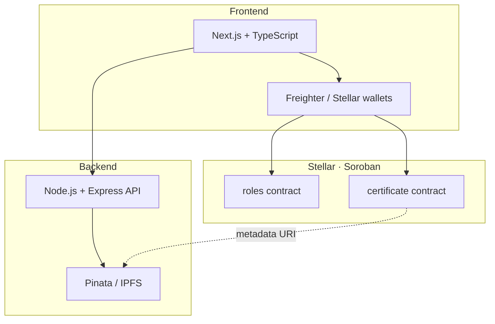
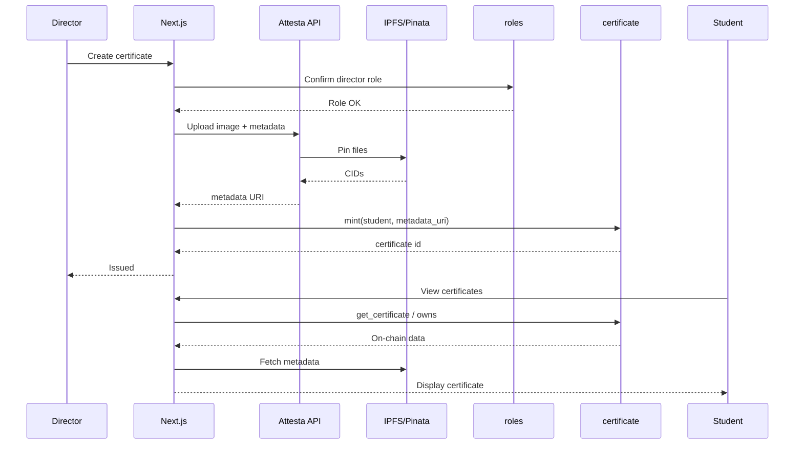

<div align="center">

# Attesta

**Decentralized Academic Certificate Management on Stellar (Soroban)**

Issue, store, and verify academic credentials as on-chain records — inspired by CertifyChain, rebuilt for Stellar.

[](LICENSE)
[](https://stellar.org)
[](#-repository-structure)

</div>

---

## Problem

Traditional academic certification systems face:

- **Document forgery** — paper certificates are easy to falsify
- **Slow verification** — manual checks can take weeks
- **Centralized control** — institutional single points of failure
- **Limited access** — geographic and bureaucratic barriers
- **High cost** — expensive processes for employers and schools

## Solution

**Attesta** is a decentralized platform that issues, manages, and verifies academic certificates on **Stellar** using **Soroban** smart contracts. Metadata and images live on **IPFS**; authenticity is proven on-chain.

| Capability | Detail |
|------------|--------|
| Immutable records | Certificate hashes anchored on Stellar |
| Instant verification | Public verify via contract + URL |
| Global access | Borderless credential checks |
| Role-based control | Admin, Director, Student |
| Decentralized storage | IPFS via Pinata |
| Type-safe stack | TypeScript (web + API) + Rust (contracts) |

> Attesta is the Stellar evolution of the [CertifyChain](https://github.com/certify-CHAIN) concept (previously on Somnia / EVM). Same product intent; new chain and monorepo.

---

## Architecture

### System overview



### Certificate issuance flow



---

## Technology stack

### Frontend (`apps/web`)
- **Next.js** (App Router) + **React** + **TypeScript**
- **Tailwind CSS**
- Stellar wallet integration (Freighter / wallet kit — planned)
- Public verification pages

### Backend (`apps/api`)
- **Node.js** + **Express** + **TypeScript**
- IPFS pinning via Pinata
- Certificate metadata helpers
- Zod validation

### Contracts (`contracts/`)
- **Rust** + **Soroban SDK**
- `roles` — Admin / Director / Student access control
- `certificate` — mint + query certificate records
- **Stellar CLI** for build, test, deploy

### Shared (`packages/shared`)
- Shared TypeScript types and network constants

---

## Repository structure

```
ATTESTA/
├── apps/
│   ├── web/                 # Next.js frontend
│   │   └── src/
│   │       ├── app/         # App Router pages
│   │       ├── components/  # UI components
│   │       ├── config/      # Stellar + env config
│   │       ├── hooks/
│   │       └── lib/
│   └── api/                 # Node TypeScript API
│       └── src/
│           ├── config/
│           ├── routes/
│           └── services/
├── contracts/               # Soroban workspace
│   └── contracts/
│       ├── roles/
│       └── certificate/
├── packages/
│   └── shared/              # Shared TS types
├── docs/                    # Extra documentation
├── package.json             # npm workspaces root
├── LICENSE
└── README.md
```

---

## Quick start

### Prerequisites

- **Node.js** 18+ and npm
- **Rust** toolchain (for Soroban)
- [Stellar CLI](https://developers.stellar.org/docs/tools/cli) (`stellar`)
- Optional: Freighter wallet, Pinata account

### Install

```bash
git clone https://github.com/Skull-Labs/ATTESTA.git
cd ATTESTA
npm install
```

### Frontend

```bash
cp apps/web/.env.example apps/web/.env.local
npm run dev:web
# http://localhost:3000
```

### Backend

```bash
cp apps/api/.env.example apps/api/.env
npm run dev:api
# http://localhost:4000
```

### Contracts

```bash
# Unit tests
npm run contracts:test

# Build WASM
npm run contracts:build
```

Deploy (after funding a testnet identity):

```bash
cd contracts
stellar contract deploy \
  --wasm target/wasm32v1-none/release/roles.wasm \
  --source-account <ALIAS> \
  --network testnet

stellar contract deploy \
  --wasm target/wasm32v1-none/release/certificate.wasm \
  --source-account <ALIAS> \
  --network testnet
```

---

## Roles & product features

### Roles
- **Admin** — owns the roles contract; grants Director / Student
- **Director** — authorized certificate issuer
- **Student** — certificate recipient / owner

### Lifecycle
1. **Issuance** — Director creates certificate + template data  
2. **Storage** — Image + JSON pinned to IPFS  
3. **Mint** — `certificate.mint` stores record on Soroban  
4. **Verification** — Anyone checks contract state or public URL  
5. **Ownership** — Student address owns the on-chain certificate  

---

## Environment variables

### `apps/web/.env.local`

```env
NEXT_PUBLIC_API_URL=http://localhost:4000
NEXT_PUBLIC_STELLAR_NETWORK=testnet
NEXT_PUBLIC_STELLAR_RPC_URL=https://soroban-testnet.stellar.org
NEXT_PUBLIC_ROLES_CONTRACT_ID=
NEXT_PUBLIC_CERTIFICATE_CONTRACT_ID=
```

### `apps/api/.env`

```env
PORT=4000
CORS_ORIGIN=http://localhost:3000
STELLAR_NETWORK=testnet
STELLAR_RPC_URL=https://soroban-testnet.stellar.org
ROLES_CONTRACT_ID=
CERTIFICATE_CONTRACT_ID=
PINATA_JWT=
PINATA_GATEWAY=
```

---

## Network

| Setting | Value |
|---------|--------|
| Network | Stellar Testnet |
| Soroban RPC | `https://soroban-testnet.stellar.org` |
| Passphrase | `Test SDF Network ; September 2015` |
| Explorer | [Stellar Expert](https://stellar.expert/explorer/testnet) / [Lab](https://lab.stellar.org) |

Contract IDs will be listed here after first testnet deploy.

---

## Documentation

| Doc | Description |
|-----|-------------|
| [Architecture](docs/ARCHITECTURE.md) | Layers, data flow, contract boundaries |
| [Development](docs/DEVELOPMENT.md) | Local setup, scripts, conventions |
| [Roadmap](docs/ROADMAP.md) | Phased delivery plan |
| [Contributing](CONTRIBUTING.md) | How to contribute |

---

## Security

- Role-gated issuance (admin / director)
- On-chain immutability for certificate records
- IPFS content addressing for metadata integrity
- No private keys in the repo — use `.env` locally only

---

## Roadmap (summary)

1. **Core** — roles + certificate contracts, API metadata scaffold, landing UI ✅ scaffold  
2. **Product** — Freighter connect, director mint UI, student dashboard, public verify  
3. **Storage** — Pinata upload end-to-end, QR verification links  
4. **Ecosystem** — institution onboarding, batch mint, APIs for third parties  

See [docs/ROADMAP.md](docs/ROADMAP.md).

---

## Heritage

Product concept adapted from **CertifyChain** ([github.com/certify-CHAIN](https://github.com/certify-CHAIN)) — academic NFT certificates on Somnia/EVM. Attesta ports that idea to **Stellar Soroban** in a single monorepo (Next + Node + Rust).

---

## License

MIT — see [LICENSE](LICENSE).

---

## Team

Built by **Skull Labs** as **Attesta** on Stellar.

---

<div align="center">

**Attesta** — verifiable education credentials on Stellar

</div>
